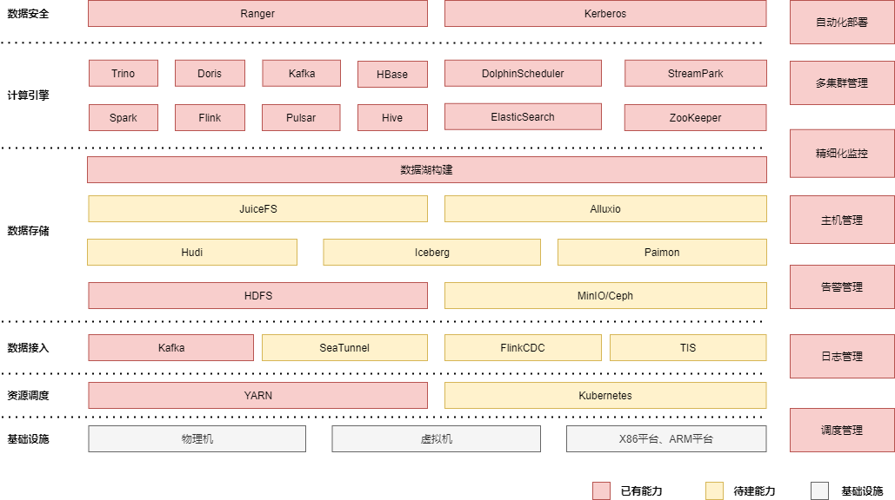

         
 <h1>DataSophon</h1>
 <h3>帮助您更容易地管理和监控集群</h3>

  
  
  
  
  

    <a href="https://datasophon.github.io/datasophon-website/">官网</a> |
    <a href="https://github.com/datasophon/datasophon/blob/main/README.md">English</a>
  

<h3>觉得不错的话，star fork下，欢迎社区开发者共建DataSophon</h3>

# 愿景

致力于快速实现部署、管理、监控以及自动化运维大数据云原生平台，帮助您快速构建起稳定、高效、可弹性伸缩的大数据云原生平台。

# DataSophon是什么

《三体》，这部获世界科幻文学最高奖项雨果奖的作品以惊艳的"硬科幻"风被大家所熟知，其作者刘慈欣更是被誉为"单枪匹马将中国科幻提高到世界级水平"。

作为三体中非常重要的角色，智子(Sophon)是将九维的质子进行二维展开，通过电路蚀刻改造成超级计算机后，再转回到微观的十一维来监控人类的一举一动，并利用量子纠缠实现瞬时通信报告给4光年之外的三体文明。说白了智子是三体文明部署在地球的AI实时远程监控和管理平台。

DataSophon也是个类似的管理平台，只不过与智子不同的是，智子的目的是锁死人类的基础科学阻碍人类技术爆炸，而DataSophon是致力于快速实现部署、管理、监控以及自动化运维大数据云原生平台，帮助您快速构建起稳定、高效、可弹性伸缩的大数据云原生平台。

## 主要特性

* 极易部署，用户仅需几步即可完成初始化环境配置，从而快速地完成大规模大数据集群的部署，支持数千个节点规模。
* 全面兼容开源生态，基于开放式的管理架构，已集成多种常用大数据组件，包括数据集成、数据存储、计算引擎、任务调度、权限管理等大数据处理的各个环节。
* 兼容复杂环境，极简的架构设计，使其极易适配各种复杂环境，支持arm和x86机器混合部署，支持常用的Linux生态操作系统。
* 便捷运维，基于生产实践展示用户最关心的监控指标，可方便地对集群、节点和服务进行监控和运维操作，助您大幅提升运维工作效率。
* 安全可靠，DataSophon支持Kerberos身份认证和数据加密，使用Ranger数据访问控制，从而支持数据加密和权限控制，保证数据安全。
* 便捷告警，支持告警组和告警指标管理，监控指标全面丰富，用户可根据监控指标自定义告警组和告警指标。

# 产品架构

# 技术架构

# 提问
如果您有任何的疑问或需要支持、报告漏洞，请点击 [issue](https://github.com/datasophon/datasophon/issues/new/choose) 并提交您的问题, 我们将及时回复您。

# 交流与贡献

欢迎您加入社区交流分享，也欢迎您为社区贡献自己的力量。

在此非常感谢大家的支持~

微信社区群（推荐）：扫描二维码添加微信，邀请进群，申请备注 “ DataSophon”。

