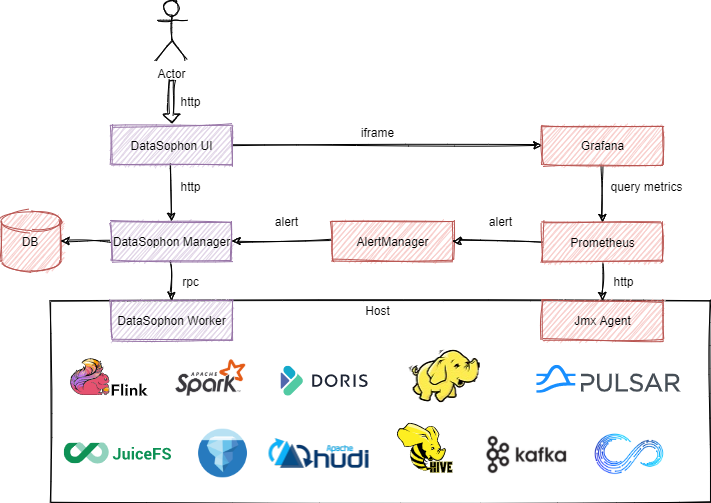

         
 <h1>DataSophon</h1>
 <h3>帮助您更容易地管理和监控集群</h3>

  
  
  
  
  

    <a href="https://datasophon.github.io/datasophon-website/">官网</a> |
    <a href="https://github.com/datasophon/datasophon/blob/main/README.md">English</a>
  

<h3>觉得不错的话，star fork下，欢迎社区开发者共建DataSophon</h3>

# 愿景

致力于快速实现部署、管理、监控以及自动化运维大数据服务组件和节点的能力，帮助您快速构建起稳定，高效的大数据集群服务。

# DataSophon是什么

《三体》，这部获世界科幻文学最高奖项雨果奖的作品以惊艳的"硬科幻"风被大家所熟知，其作者刘慈欣更是被誉为"单枪匹马将中国科幻提高到世界级水平"。

作为三体中非常重要的角色，智子(Sophon)是将九维的质子进行二维展开，通过电路蚀刻改造成超级计算机后，再转回到微观的十一维来监控人类的一举一动，并利用量子纠缠实现瞬时通信报告给4光年之外的三体文明。说白了智子是三体文明部署在地球的AI实时远程监控和管理平台。

DataSophon也是个类似的管理平台，只不过与智子不同的是，智子的目的是锁死人类的基础科学阻碍人类技术爆炸，而DataSophon是致力于自动化监控、运维、管理大数据基础组件和节点的，帮助您快速构建起稳定，高效的大数据集群服务。

## 主要特性

* 极易部署,可快速完成300节点的大数据集群部署
* 国产化兼容,兼容arm服务器和常用国产化操作系统
* 监控指标全面丰富，基于生产实践展示用户最关心的监控指标
* 灵活便捷的告警服务，可实现用户自定义告警组和告警指标
* 可扩展性强，用户可通过配置的方式集成或升级大数据组件

# 产品架构

# 技术架构

# 提问
如果您有任何的疑问或需要支持、报告漏洞，请点击 [issue](https://github.com/datasophon/datasophon/issues/new/choose) 并提交您的问题, 我们将及时回复您。

