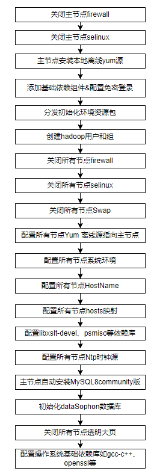
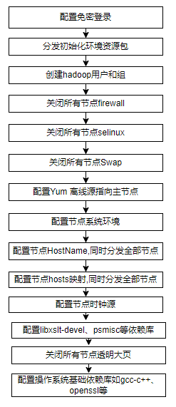

<div align="center">
         <a href="https://github.com/datasophon/datasophon" target="_blank" rel="noopener noreferrer">
           
        </a>
 <h1>DataSophon</h1>
 <h3>帮助您更容易地管理和监控集群</h3>
</div>

<p align="center">
  
  
  
  <a href="https://www.apache.org/licenses/LICENSE-2.0.html"></a>
  <p align="center">
    <a href="https://datasophon.github.io/datasophon-website/">官网</a> |
    <a href="https://github.com/datasophon/datasophon/blob/main/README.md">English</a>
  </p>
</p>
<h3>觉得不错的话，star fork下，欢迎社区开发者共建DataSophon</h3>  

# datasophon-init模块特性

* 简化集群部署过程中服务器操作系统的准备和配置环节；
* 自动安装配置所需依赖减少集群运维人员的工作量；
* 自动化配置减少因人为的疏忽而遗漏配置导致的安装失败；
* 支持一次性全量服务器集群节点环境的自动初始化配置和后续新增扩展节点服务器环境的初始化；
* 方便友好，支持自定义扩展二次开发来兼容不同类型的操作系统；

#  dataSophon-init模块使用说明  

## 一、使用前须知
当前组件的版本是根据centos8.5和openEuler-22.03进行开发适配的，其它类型和版本的操作系统目前没有进行详细的测试验证可能存在兼容性问题，需要对shell脚本和本地YUM离线安装包进行适配，主要是因为不同的操作系统一些依赖包不一样；

## 二、组件说明

###  dataSophon-init目录结构如下：
[root@localhost datasophon-init]# ls -l  
总用量 8    
drwxr-xr-x 2 root root 4096 8月  10 17:09 bin     
drwxr-xr-x 2 root root   99 7月  28 16:10 config  
drwxr-xr-x 8 root root 4096 8月   9 13:47 packages    
drwxr-xr-x 2 root root  189 7月  27 11:35 remove  
drwxr-xr-x 3 root root   50 8月  10 20:02 sbin    
drwxr-xr-x 2 root root   70 8月   7 10:54 sql


### 上面的各个目录解释如下：

* bin：datasophon服务器集群环境配置初始化程序脚本(单个模块初始化脚本所在目录，无需手动管理);
* config：datasophon服务器集群环境一键初始化所需配置文件目录，需要用户手动修改;
* packages：初始化过程需要的依赖安装包存放目录;
* remove：卸载环境脚本;
* sbin：一键初始化环境脚本所在目录;
* sql：datasophon数据库初始化sql脚本所在目录;


### 在 config 目录下面有三个配置文件：
* init.properties：主要配置私有化 yum 源安装节点信息、namp 安装节点信息、mysql 数据库安装节点信息、修复机器总数、服务器操作系统类型、以及修复模块日志存放位置。用户根据需要自行修改相关配置项；
* init-host-info.properties：节点全量初始化，需要配置此文件，具体配置所有节点内网 Ip、密码、端口号以及主机名；
* init-host-info-add.properties：集群新增节点初始化时，需要配置此文件，具体配置新增节点内网 Ip、密码、端口号以及主机名；

#### init.properties 说明

* yum.repo.need：填写是否需要部署私有化yum源（true:需要/false:不需要，如服务器不能连接外网必须部署私有化yum源用来离线安装所需的rpm依赖）；
* yum.repo.host.ip：填写即将部署私有化yum源的节点的内网IP（即执行init脚本的节点IP，推荐在主节点上进行）；
* namp.server.ip：填写未来要部署的datasophon管理端的节点内网IP；
* namp.server.port：填写未来要部署的datasophon管理端节点的SSH端口号，默认22；
* namp.server.password：填写未来要部署的datasophon管理端节点的密码，这个密码最好不要有特殊字符比如‘,’、‘$’等以免因为特殊符号的原因导致认证失败；
* ntp.master.ip： 填写未来要部署ntp时钟同步的主节点服务器IP（推荐主节点）；
* mysql.ip： 填写未来要部署mysql数据库的节点服务器IP（推荐主节点）；
* mysql.host.ssh.port： 填写未来要部署mysql数据库的节点服务器SSH端口，默认为22；
* mysql.host.ssh.password： 填写未来要部署mysql数据库的节点服务器的密码；
* mysql.password： 填写未来要部署mysql数据库的root密码，这个密码不要有特殊字符比如‘,’、‘$’等，可在初始化完成之后再自行设置高复杂度密码；
* init.host.num： 填写未来要初始化的服务器数量；
* init.add.host.num： 填写未来要初始化的新增服务器节点数量，全量初始化时无需修改；
* init.log.dir  ：设置初始化服务器环境时日志存放目录；
* init.os ：填写服务器操作系统类型openEuler、centos8；

#### init-host-info.properties 说明

* dataSophon.ip.i=172.31.51.194  #预备安装dataSophon集群的节点内网IP（i表示1-n的取值，n为集群节点数量）；
* dataSophon.password.i=xxxxx   #预备安装dataSophon集群的节点的登录密码；
* dataSophon.ssh.port.i=22      #预备安装dataSophon集群的节点的SSH端口默认22；
* dataSophon.ssh.port.hostname.i=dataSophon01   #预备安装dataSophon集群的节点的主机名；

#### init-host-info-add.properties 说明（需要对新增的节点进行初始化时才需要配置此文件 ，可以新增1-n个）

* dataSophon.ip.i=172.31.51.162  #预备新增dataSophon集群的节点内网IP（i表示1-n的取值，n为集群节点数量）；
* dataSophon.password.i=xxxxx   #预备新增安装dataSophon集群的节点的登录密码；
* dataSophon.ssh.port.i=22      #预备新增安装dataSophon集群的节点的SSH端口默认22；
* dataSophon.ssh.port.hostname.i=dataSophon05   #预备新增安装dataSophon集群的节点的主机名；

## 三、组件使用前的配置步骤说明（以下为针对首次使用以openEuler为例）

### 1、主节点创建所需目录（以下操作都在主节点进行）
  ``` 
  mkdir /data
  mkdir -p /data/private-yum-library_temp
  mkdir -p /data/private-yum-library
  mkdir -p /data/private-yum-library/repo
  mkdir -p /data/private-yum-library/epel
  ```
### 2、准备资源包
* 将datasophon-init整个目录拷贝到 “/data” 目录下；   
* 下载packages.tar.gz 离线依赖库并移到主节点的 “/data/datasophon-init”下并解压 ```tar -xzf packages.tar.gz -C /data/datasophon-init/```,下载链接：https://pan.baidu.com/s/1iqudVwDgg2x_OO35VLkkSg 提取码：6zrz   
* 将服务器操作系统对应的iso镜像文件，建议使用everything版本的这样包含的依赖包更全一点如：```openEuler-22.03-LTS-SP2-everything-x86_64-dvd.iso``` 拷贝到“/data/”目录下；
### 3、制备离线YUM源（离线rpm库）
#### PS:服务器未联网的情况需要配置离线YUM源,能连公网的话就不用配置离线yum源，但是需要将服务器的YUM源配置为国内阿里的或者华为的这样安装依赖会比较快
* 修改init.properties参数
```
yum.repo.need=true
init.os=openEuler
其它参数根据实际情况修改
```
* 执行挂载操作系统命令：``` mount -o loop /data/openEuler-22.03-LTS-SP2-everything-x86_64-dvd.iso /data/private-yum-library_temp```，这种挂载重启服务器之后会失效，所以我们挂载完成后将ios内的文件全部拷贝出来做离线yum源用;
* 将private-yum-library_temp目录下的文件全部拷贝到/data/private-yum-library/repo目录下：```cp -r /data/private-yum-library_temp/* /data/private-yum-library/repo```,另外不同操作系统挂载后所产生的目录不同，比如centos8的repo有两个BaseOS和AppStream;    
* 将原本的yum源的配置文件进行备份 ：```mkdir -p /etc/yum.repos.d/bak && mv /etc/yum.repos.d/*.repo /etc/yum.repos.d/bak```;    
* 其它说明：epel目录是为了给需要自行配置离线eprl源的用户准备的，如果能配置epel建议进行配置，因为很多操作系统额外的很多工具包都在对应的epel中,配置之后在未来集群需要安装额外的扩展时会很方便;    
### 4、根据实际集群规划修改配置文件
* 修改config 目录下的配置文件，根据自己需要配置的节点实际情况进行修改，如果配置文件配置错误会导致初始化失败；

### 5、其它注意事项
* 集群时钟源配置：集群NTP时钟默认使用Chrony,如使用其它的方式请自行安装配置，并将sbin/init.sh 脚本中的 initALL() 方法中的‘initAllNtpChronyService’  和 ‘checkNtpChronyService’方法注释掉避免重复安装；   
* 脚本的初始化需要用到python环境，核心是使用pssh进行集群间的命令执行控制，目前packages.tar.gz中的pssh.tar.gz文件已经内置了三个版本的安装包:   
    ```
    pssh-2.3.1-5.el7.noarch.rpm 需要python2.7的支持适用于centos7系列;  
    pssh-2.3.1-29.el8.noarch.rpm 需要python3.6的支持适用于centos8系列;     
    pssh-2.3.4-1.el9.noarch.rpm 需要python3.9的支持适用于openEuler系列;  

  Centos7、Centos8操作系统镜像中的repo中已经存在对应的rpm格式的pssh包了,目前openEuler22.03中还没有pssh相关的安装包, 其它版本pssh的rpm包下载工具地址：http://rpmfind.net/linux/rpm2html/search.php?query=pssh，可以根据操作系统和python版本进行适配 ；
    ```


## 四、首次全量初始化操作

### 全量初始化脚本的流程


### 执行初始化脚本

完成上述步骤后，执行如下命令即可开始一键初始化任务。
``` 
cd /data/datasophon-init/sbin    
bash init.sh initAll 
等待程序执行完毕，中间需要有一次确认服务器时间的确认项需要选择
```
PS:执行完毕之后如果服务器的终端未关闭，可能会出现一些命令无效的情况，此时需要手动在终端执行 ```source /etc/profile```使环境变量生效，或者关闭终端重新打开 ； 

当执行完 bash init.sh initAll 之后，会看到有下面输出很多的日志，因为需要配置本地离线yum源以及安装mysql8等整个过程需要一定的时间，可以查看log目录下的安装日志  
其中mysql初始化的数据库默认为datasophon，初始化过程中会自动创建用户"datasophon"密码为"datasophon"     

#### 当前初始化模块支持的操作系统版本为：CentOS-8.5.2111-x86_64、openEuler-22.03
#### 当前初始化模块自动安装配置的mysql为：mysql-community-8.0.28


## 五、集群新增节点初始化操作
### 新增节点初始化流程


### 执行初始化脚本
将config/init.properties文件中的'init.add.host.num'参数修改为即将新增加的节点的实际数量（init.host.num参数为当前已有的节点数量），只支持整数；
编辑config/init-host-info-add.properties，将文件中的指定信息按照既定格式进行修改，主要包括新增节点的ip、password、sshport、hostname；
完成上述步骤后，执行如下命令即可开始一键初始化任务。
```
cd /data/datasophon-init/sbin    
bash init.sh initSingleNode
等待程序执行完毕，中间需要有一次确认服务器时间的确认项需要选择
```
PS:执行完毕之后如果服务器的终端未关闭，可能会出现一些命令无效的情况，此时需要手动在终端执行```source /etc/profile```使环境变量生效，或者关闭终端重新打开 


